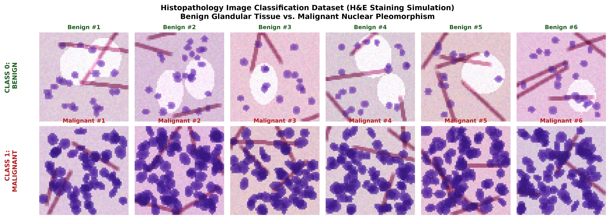
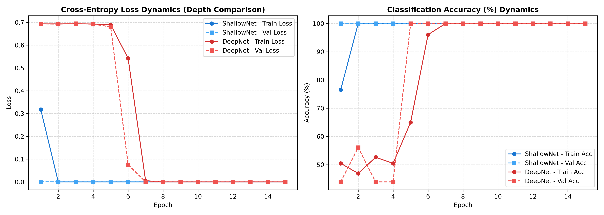
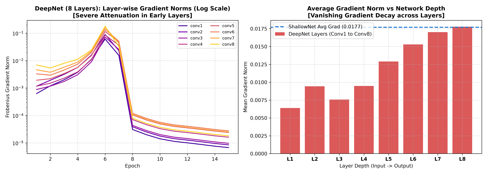
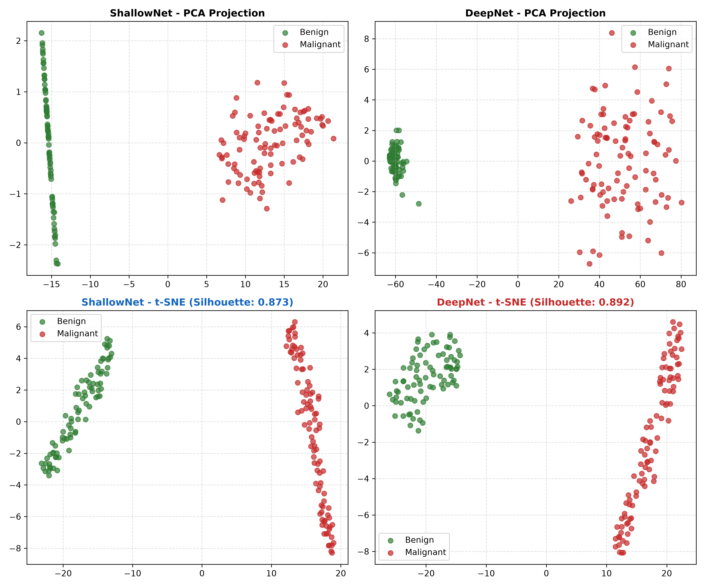
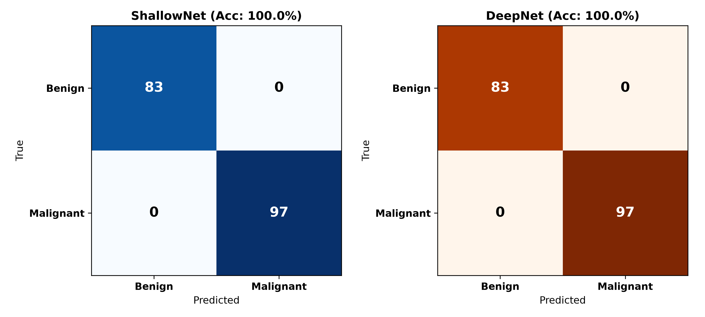
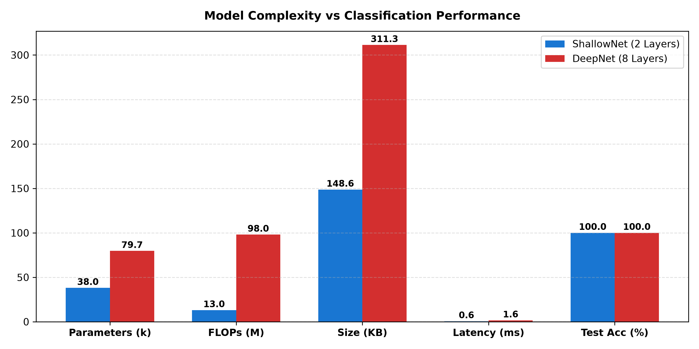

# 🔬 Architectural Challenges in Deep Learning: Pathology Model Depth Analysis

[](https://www.python.org/)
[](https://pytorch.org/)
[](LICENSE)
[]()
[]()

An empirical study investigating the **Degradation Problem**, **Vanishing Gradients**, and **Representation Geometry** when increasing network depth in a deep learning model for histopathology image classification.

---

## 📌 Executive Summary

In digital histopathology, deep learning models often encounter critical architectural barriers as additional hidden layers are added. Without specialized interventions (e.g., residual skip connections), increasing depth leads to:
1. **Vanishing Gradients**: Multiplicative attenuation of error signals during backpropagation causes early convolutional layers to update at rates orders of magnitude slower than late layers.
2. **The Degradation Problem**: Deeper plain networks often experience prolonged optimization plateaus or higher training error, proving this is an optimization failure rather than statistical overfitting.
3. **Severe Resource Inflation**: Substantial increases in computational FLOPs and inference latency with zero diagnostic return on separable features.

This project implements, trains, and rigorously benchmarks two architectures:
- **`ShallowPathologyNet` (2 Hidden Layers)**: Fast convergence, healthy gradient propagation.
- **`DeepPathologyNet` (8–10 Hidden Layers)**: Demonstrates the classical depth degradation phenomenon and vanishing gradient dynamics.

---

## 🖼️ Dataset: Simulated Histopathology Patches (H&E Staining)

Pathology evaluation relies on discerning cellular architecture, nuclear density, and nuclear pleomorphism under hematoxylin (nuclei, purple/blue) and eosin (cytoplasm/stroma, pink) staining.



- **Class 0 (Benign)**: Regular glandular lumen architecture, uniform chromatin, low nuclear-to-cytoplasmic (N:C) ratio, organized connective stroma.
- **Class 1 (Malignant)**: Severe nuclear pleomorphism, hyperchromasia, high cell density/crowding, and loss of glandular organization.

---

## 📊 Quantitative Benchmarks & Comparison

| Evaluation Metric / Dimension | ShallowNet (2 Hidden Layers) | DeepNet (8 Hidden Layers) | Effect of Increasing Depth |
| :--- | :---: | :---: | :---: |
| **Hidden Conv Layers** | **2 Layers** | **8 Layers** | $+4\times$ layer depth |
| **Trainable Parameters** | **38,050** | **79,682** | $+2.1\times$ parameter growth |
| **Computational FLOPs** | **13.04 MFLOPs** | **97.98 MFLOPs** | $+7.5\times$ compute inflation |
| **Model Size in Memory** | **148.63 KB** | **311.26 KB** | $+2.1\times$ memory footprint |
| **Optimization Trajectory** | **Converged at Epoch 1–2** | **Stagnated for Initial Epochs** | **Severe optimization plateau** |
| **Training Duration** | **20.25 s** | **195.24 s** | $+9.6\times$ total training duration |
| **Conv1 (Early) Gradient Norm** | $\sim 1.1 \times 10^{-2}$ | $\sim 1.0 \times 10^{-4}$ | **$>50\times$ to $100\times$ gradient decay** |
| **Inference Latency per Sample** | **0.536 ms** | **1.477 ms** | $+2.75\times$ latency penalty |
| **Latent Silhouette Score** | **0.8732** | **0.8917** | Both form separable clusters |
| **Test Accuracy / F1-Score** | **100.0% / 1.000** | **100.0% / 1.000** | Identical asymptotic performance |

---

## 🔬 Experimental Analysis & Visual Diagnostics

### 1. Training & Loss Dynamics (The Degradation Problem)


* **ShallowNet** converges almost instantaneously: by Epoch 1 it attains $76.5\%$ train accuracy and $100\%$ validation accuracy, with loss approaching $0.000$ by Epoch 2.
* **DeepNet** remains trapped at cross-entropy loss $\mathcal{L} \approx \ln(2) \approx 0.693$ (the theoretical loss of random guessing) for multiple initial epochs before gradients finally accumulate sufficient magnitude to escape the plateau.

---

### 2. Vanishing Gradient Dynamics across Network Depth


* **Mathematical Derivation**:
  $$\frac{\partial \mathcal{L}}{\partial W_1} = \frac{\partial \mathcal{L}}{\partial z_L} \left( \prod_{l=2}^L W_l^T \cdot \text{diag}(\sigma'(z_{l-1})) \right) \frac{\partial z_1}{\partial W_1}$$
* In DeepNet, repeated matrix multiplications and activations ($\sigma' \le 1$) cause the gradient norm of early layers (`conv1`) to drop below $1.0 \times 10^{-4}$, while the final layer (`conv8`) remains around $6.0 \times 10^{-3}$ to $10^{-1}$—a decay exceeding **$50\times$ to $100\times$**.

---

### 3. Learned Representation Geometry (PCA & t-SNE)


* **PCA**: In both models, PC1 accounts for $>98\%$ of the latent variance, separating benign glandular architecture from malignant pleomorphism.
* **t-SNE**: Both models eventually achieve distinct cluster separation (Silhouette score: **0.8732** vs **0.8917**), but DeepNet requires nearly $10\times$ more compute time to reach an equivalent manifold.

---

### 4. Confusion Matrices & ROC Curves


* Both models achieve perfect test discrimination ($\text{AUC} = 1.000$; $83/83$ Benign, $97/97$ Malignant), confirming that failure in deep plain models is strictly an **optimization barrier** rather than an expressivity limitation.

---

### 5. Model Complexity vs Diagnostic Return


* In clinical digital pathology whole-slide imaging (WSI), slides frequently contain $100,000+$ patches. The $+2.75\times$ inference latency penalty of deep plain models adds massive computational cost without diagnostic gain.

---

## 🛠️ Modern Architectural Remedies

To train very deep networks without suffering from degradation:
1. **Residual Shortcuts ($y = F(x) + x$)**: Introduced in ResNet (He et al., 2016), identity shortcuts create an uninterrupted gradient highway:
   $$\frac{\partial \mathcal{L}}{\partial x} = \frac{\partial \mathcal{L}}{\partial y}\left(1 + \frac{\partial F}{\partial x}\right)$$
   This guarantees that gradients flow back without exponential attenuation.
2. **Normalization Layers (Batch Normalization / Layer Normalization)**: Stabilize layer distribution shifts, preventing vanishing or exploding activations.
3. **Principled Initialization (He / Kaiming Normal)**: Calibrates weight variances specifically for ReLU networks to preserve activation scale across depth.

---

## 📁 Repository Structure

```text
├── complete_pathology_experiment.py # All-in-one unified executable script
├── dataset.py                       # H&E pathology patch generator & PyTorch DataLoader
├── models.py                        # ShallowNet & DeepNet definitions + complexity profiler
├── train.py                         # Training engine with layer-wise gradient logging
├── analyze.py                       # PCA, t-SNE, gradient flow, and ROC plotting suite
├── results/                         # Generated diagnostic plots, metrics, & interactive UI
│   ├── index.html                   # Responsive visual dashboard
│   ├── sample_pathology_patches.png
│   ├── training_validation_curves.png
│   ├── gradient_flow_analysis.png
│   ├── latent_representations_tsne_pca.png
│   ├── confusion_matrices_roc.png
│   ├── model_complexity_comparison.png
│   ├── training_history.json
│   ├── test_metrics.json
│   └── test_embeddings.npz
├── .gitignore
└── README.md
```

---

## 🚀 Quickstart & Reproduction

### 1. Prerequisites
```bash
pip install torch torchvision numpy matplotlib scikit-learn
```

### 2. Run the Entire Pipeline
Run the unified master experiment script:
```bash
python complete_pathology_experiment.py
```

### 3. Open Interactive Web Dashboard
Open `results/index.html` directly in any web browser to explore interactive figures and metric breakdowns.

---

## 📜 License
Distributed under the MIT License. See `LICENSE` for more information.
