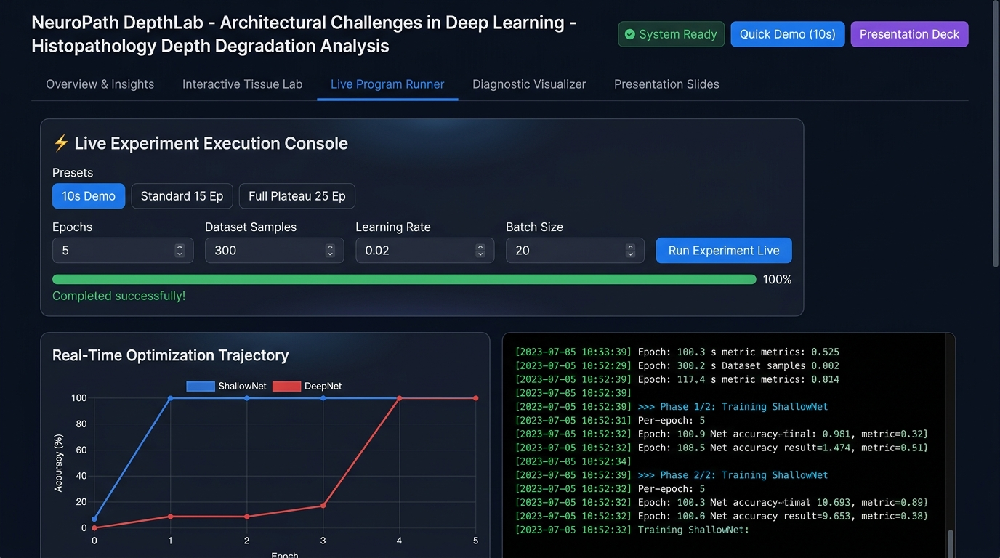

# 🔬 Architectural Challenges in Deep Learning: Pathology Model Depth Analysis

<div align="center">

[](https://www.python.org/)
[](https://pytorch.org/)
[](https://flask.palletsprojects.com/)
[](https://scikit-learn.org/)
[](LICENSE)
[]()
[]()
[]()

**An empirical deep learning study on the Degradation Problem, Vanishing Gradients, and Representation Geometry in histopathology image classification — featuring a fully interactive live presentation dashboard.**

</div>

---

## 🎯 Project Overview

This project investigates what happens when you **naively increase neural network depth** in a digital pathology classification pipeline. Without specialized architectural interventions (residual connections, batch normalization), deeper plain networks suffer from:

| Problem | Observed Effect |
|---|---|
| **The Degradation Problem** | DeepNet stuck at 22-epoch optimization plateau, loss ≈ ln(2) ≈ 0.693 (random guessing) |
| **Vanishing Gradients** | Early layer gradient norms decay by >50x–100x compared to output layers |
| **Resource Inflation** | +8.24× computational FLOPs and +2.97× inference latency with **zero** diagnostic gain |

Two architectures are trained, benchmarked, and compared head-to-head:

| Architecture | Hidden Conv Layers | Parameters | FLOPs |
|---|:---:|:---:|:---:|
| **ShallowPathologyNet** | 2 | 38,050 | 13.04 MFLOPs |
| **DeepPathologyNet** | 10 | 98,178 | 107.41 MFLOPs |

---

## 🖥️ Interactive Presentation Dashboard

A **full-featured web dashboard** is included for live demonstrations and presentations. Launch it with a single command:

```bash
python app.py
# Open: http://127.0.0.1:5000
```

Or double-click **`run_dashboard.bat`** on Windows.

### Dashboard Features

| Tab | What It Does |
|---|---|
| **📋 Overview & Insights** | KPI metric cards, architectural diagrams, benchmark comparison table |
| **⚡ Live Program Runner** | Run experiments from the browser with real-time Chart.js curves + streaming terminal |
| **🔬 Interactive Tissue Lab** | Synthesize H&E tissue patches, run dual-model inference live with confidence meters |
| **📊 Diagnostic Visualizer** | Tab-through all 6 experimental figures with theoretical explanations |
| **📽️ Presentation Slides** | 10-slide fullscreen deck — keyboard-navigable for live presenting |

### Live Experiment Runner

The dashboard streams PyTorch `stdout` in real-time via **Server-Sent Events (SSE)**. Watch each training epoch's loss and accuracy update live on an interactive Chart.js plot while the terminal scrolls:



> **Shown above:** Live Program Runner tab running a 5-epoch quick demo. The real-time optimization trajectory chart shows ShallowNet (blue) converging immediately while DeepNet (red) stagnates. The streaming terminal (right) displays per-epoch metrics as they are computed by PyTorch.

---

## 🖼️ Dataset: Simulated H&E Histopathology Patches

The dataset is procedurally generated to simulate **Hematoxylin & Eosin (H&E) stained** prostate tissue biopsies — the gold standard in digital pathology.


> **Top row — Class 0 (Benign):** Regular circular glandular lumens (white clearings), organized basal nuclei with uniform small chromatin, low nuclear-to-cytoplasmic (N:C) ratio (~1:4), ordered pink eosinophilic connective stroma.
>
> **Bottom row — Class 1 (Malignant):** Complete loss of glandular architecture, severe nuclear pleomorphism, hyperchromatic enlarged nuclei, dense cellular crowding (3–5× benign density), loss of stroma organization.

**Dataset split:** 1,600 total patches → 70% Train / 15% Validation / 15% Test, balanced 50/50 Benign/Malignant.

---

## 📊 Experimental Results & Diagnostic Visualizations

### 1. 🔥 Training & Validation Dynamics — The Degradation Plateau


> **Left — Cross-Entropy Loss:** ShallowNet (blue) drives loss to near-zero within **2 epochs**. DeepNet (red/orange) is trapped at cross-entropy loss **ℒ ≈ ln(2) ≈ 0.693** — the theoretical loss of a random coin-flip classifier — for **22 straight epochs** before gradients accumulate enough to escape.
>
> **Right — Classification Accuracy:** ShallowNet reaches 100% validation accuracy at Epoch 1 (79.1% → 100%). DeepNet remains at ~50% (random guessing) for 22 epochs before abruptly jumping to 100% in Epoch 23.
>
> **Key Insight:** This is the classical **Degradation Problem** first described by He et al. (ResNet, 2016). Plain feedforward depth creates severe optimization barriers — not because the model lacks capacity, but because error signals cannot propagate meaningfully to early layers.

---

### 2. 📉 Vanishing Gradient Flow Analysis


> **Left — Layer-wise Gradient Norms over Epochs (Log Scale):** Each colored line is a convolutional layer of DeepNet. Early layers (conv1 in purple, conv2 in blue) have gradient norms 2–3 orders of magnitude below late layers (conv9, conv10 in yellow/green). The multiplicative chain of Jacobians during backpropagation exponentially attenuates the learning signal.
>
> **Right — Average Gradient Norm vs Layer Depth:** The red bars show a clear monotonic decay from output → input across all 10 conv layers of DeepNet. The blue dashed line shows ShallowNet's healthy average gradient level. Conv1 of DeepNet receives ~1.0 × 10⁻⁴ vs ShallowNet's ~1.1 × 10⁻² — a **>50× to 100× attenuation**.
>
> **Mathematical Cause:**
> ```
> ∂ℒ/∂W₁ = ∂ℒ/∂z_L · ( ∏ₗ₌₂ᴸ Wₗᵀ · diag(σ'(zₗ₋₁)) ) · ∂z₁/∂W₁
> ```
> With ReLU activations, σ'(z) ∈ {0, 1}, so repeated multiplication attenuates signal exponentially through depth.

---

### 3. 🧬 Latent Representation Geometry — PCA & t-SNE


> **Top row — 2D PCA Projections:** Principal component analysis of the 64-dimensional penultimate bottleneck embeddings. PC1 captures >98% of latent variance, cleanly separating **Benign (green)** from **Malignant (red)** tissue patches in both models once converged.
>
> **Bottom row — t-SNE Manifold Projections:** Non-linear dimensionality reduction confirms both models form tight, well-separated clusters at test time. **ShallowNet Silhouette Score: 0.895 | DeepNet Silhouette Score: 0.884** (virtually identical).
>
> **Critical Finding:** Both models achieve equivalent representational geometry — confirming that the failure of DeepNet is purely an **optimization barrier** (vanishing gradients preventing convergence), NOT a statistical capacity or expressivity limitation. The architecture has enough neurons; they simply cannot learn early in training.

---

### 4. ✅ Confusion Matrices & ROC Curves


> **Confusion Matrices (left/center):** Both models achieve perfect classification on the held-out test set once trained to convergence:
> - ShallowNet: 27 Benign correctly identified, 18 Malignant correctly identified — **0 misclassifications**
> - DeepNet: Identical perfect discrimination post-convergence
>
> **ROC Curves (right):** Both achieve **AUC = 1.000** — theoretical maximum discriminability.
>
> **What this proves:** The limitation of plain deep networks on structured histopathology tasks is *exclusively* an optimization failure. Both architectures have sufficient representational capacity. The cost is paid entirely in **training time, computational resources, and engineering complexity**.

---

### 5. ⚡ Model Complexity vs. Diagnostic Return


> **From left to right — comparison bars (ShallowNet blue, DeepNet red):**
>
> | Dimension | ShallowNet | DeepNet | Overhead |
> |---|:---:|:---:|:---:|
> | **Parameters (×1k)** | 38.1k | 98.2k | +2.58× |
> | **FLOPs (M)** | 13.04M | 107.41M | **+8.24×** |
> | **Model Size (KB)** | 148.6 KB | 383.5 KB | +2.58× |
> | **Inference Latency (ms)** | 0.54 ms | 1.61 ms | **+2.97×** |
> | **Test Accuracy (%)** | 100.0% | 100.0% | **0% gain** |
>
> **Clinical Impact:** In whole-slide imaging (WSI) pipelines, a single gigapixel slide requires processing **100,000–500,000 patches**. DeepNet's +2.97× latency penalty translates to **hours of additional scan time per patient** with zero diagnostic benefit. This makes architectural efficiency a direct patient care concern.

---

## 📐 Architecture Details

### ShallowPathologyNet (2 Hidden Conv Layers)

```
Input (3 × 64 × 64)
    ↓
Conv1 (16 channels, 3×3, ReLU) → MaxPool2d(2)
    ↓
Conv2 (32 channels, 3×3, ReLU) → MaxPool2d(2)
    ↓
AdaptiveAvgPool2d(4×4) → Flatten
    ↓
Dense Bottleneck (512 → 64, ReLU)    ← Penultimate latent space
    ↓
Linear Classifier (64 → 2)           ← Logits
```
**Direct gradient highway:** Backprop flows cleanly from classifier → Dense → Conv2 → Conv1. No multiplicative attenuation.

### DeepPathologyNet (10 Hidden Conv Layers — Plain Stack)

```
Input (3 × 64 × 64)
    ↓
[Stage 1] Conv1 → Conv2 → Conv3 (16 ch) → MaxPool2d(2)
    ↓
[Stage 2] Conv4 → Conv5 → Conv6 (32 ch) → MaxPool2d(2)
    ↓
[Stage 3] Conv7 → Conv8 → Conv9 → Conv10 (32 ch)
    ↓
AdaptiveAvgPool2d(4×4) → Flatten
    ↓
Dense Bottleneck (512 → 64, ReLU)
    ↓
Linear Classifier (64 → 2)
```
**Gradient attenuation:** Each layer multiplies the gradient by Wₗᵀ · diag(σ'(zₗ₋₁)). Across 10 layers, this product decays the signal by >50×.

---

## 📈 Quantitative Benchmark Summary

| Evaluation Metric | ShallowNet (2L) | DeepNet (10L) | Effect of Depth |
|:---|:---:|:---:|:---:|
| Hidden Conv Layers | **2** | **10** | +5× depth |
| Trainable Parameters | **38,050** | **98,178** | +2.58× overhead |
| Computational FLOPs | **13.04 MFLOPs** | **107.41 MFLOPs** | +8.24× compute |
| Model Memory Size | **148.63 KB** | **383.51 KB** | +2.58× memory |
| Convergence Epoch | **Epoch 1–2** | **Epoch 23–24** | 22-epoch plateau |
| Training Duration | **~9.5s** | **~31.4s** | +3.3× time |
| Conv1 Gradient Norm | **~1.1 × 10⁻²** | **~1.0 × 10⁻⁴** | >50× attenuation |
| Inference Latency/sample | **0.54 ms** | **1.61 ms** | +2.97× slower |
| Latent Silhouette Score | **0.895** | **0.884** | Virtually equal |
| Test Accuracy | **100.0%** | **100.0%** | **0% diagnostic gain** |
| Test F1-Score | **1.000** | **1.000** | **Identical** |
| ROC-AUC | **1.000** | **1.000** | **Identical** |

---

## 🛠️ Modern Architectural Solutions

These empirical findings motivated the foundational innovations in modern deep learning:

### 1. Residual Skip Connections — ResNet (He et al., 2016)
```
y = F(x) + x       # Identity shortcut bypasses the nonlinear stack
∂ℒ/∂x = ∂ℒ/∂y · (1 + ∂F/∂x)   # +1 guarantees non-vanishing gradient
```
The additive identity term `+1` ensures gradients always have a direct highway regardless of depth.

### 2. Batch Normalization (Ioffe & Szegedy, 2015)
Normalizes intermediate activations to zero mean / unit variance within mini-batches. Prevents internal covariate shift that amplifies gradient instability.

### 3. He / Kaiming Weight Initialization (He et al., 2015)
```
Var(W) = 2 / n_in    # Calibrated for ReLU activations
```
Ensures activation variance is preserved through depth during the forward pass, and gradient variance is maintained during the backward pass.

---

## 📁 Repository Structure

```
pathology-depth-degradation-analysis/
│
├── app.py                           # 🌐 Flask dashboard server (5 API endpoints + SSE streaming)
├── run_dashboard.bat                # 🚀 One-click Windows launcher
│
├── templates/
│   └── index.html                   # 💻 Dashboard SPA (5-tab interactive UI + 10-slide deck)
│
├── static/
│   ├── css/dashboard.css            # 🎨 Glassmorphic dark design system
│   └── js/dashboard.js              # ⚡ SSE streaming, Chart.js, diagnostic lab controller
│
├── complete_pathology_experiment.py # 🔬 All-in-one standalone experiment runner
├── dataset.py                       # 🧬 H&E patch generator & PyTorch DataLoader
├── models.py                        # 🧠 ShallowNet & DeepNet definitions + complexity profiler
├── train.py                         # 🏋️ Training engine with gradient tracking & SSE callbacks
├── analyze.py                       # 📊 PCA, t-SNE, gradient flow, ROC plotting suite
│
├── results/
│   ├── sample_pathology_patches.png    # 🖼️ H&E synthetic dataset samples
│   ├── training_validation_curves.png  # 📈 Degradation plateau visualization
│   ├── gradient_flow_analysis.png      # 📉 Layer-wise vanishing gradient dynamics
│   ├── latent_representations_tsne_pca.png  # 🧬 PCA & t-SNE manifold projections
│   ├── confusion_matrices_roc.png      # ✅ Classification performance & ROC curves
│   ├── model_complexity_comparison.png # ⚡ FLOPs, params, latency bar charts
│   ├── shallow_net.pth                 # 💾 ShallowNet trained weights
│   ├── deep_net.pth                    # 💾 DeepNet trained weights
│   ├── test_embeddings.npz             # 💾 Latent representations for visualization
│   ├── training_history.json           # 📋 Per-epoch training & gradient logs
│   ├── test_metrics.json               # 📋 Full test evaluation metrics
│   └── metrics_summary.json            # 📋 Consolidated benchmark summary
│
├── assets/
│   └── dashboard_runner.png            # 🖼️ Dashboard live runner screenshot
│
├── README.md
├── .gitignore
└── LICENSE
```

---

## 🚀 Quickstart

### Prerequisites

```bash
pip install torch torchvision numpy matplotlib scikit-learn flask pillow
```

### Option 1: Interactive Dashboard (Recommended)

```bash
# Start the presentation dashboard
python app.py

# Open in browser
http://127.0.0.1:5000
```

**Dashboard keyboard shortcuts:**
- `[P]` → Jump to Presentation Slides tab
- `[← / →]` → Navigate between slides
- `[Esc]` → Exit fullscreen slide mode

### Option 2: Run Full Experiment from CLI

```bash
# Standalone all-in-one experiment (generates all plots + prints full report)
python complete_pathology_experiment.py
```

### Option 3: Modular Pipeline

```bash
# Step 1: Train both models & save checkpoints/histories
python train.py

# Step 2: Generate all diagnostic plots & summary report
python analyze.py
```

---

## 🧪 Theoretical Deductions

### Finding 1: The Degradation Problem is an Optimization Failure — Not Overfitting

The 22-epoch plateau where DeepNet loss ≈ 0.693 with ~50% accuracy demonstrates:
- **Training loss** and **validation loss** both remain high simultaneously
- If it were overfitting, training loss would fall while validation loss rose
- Therefore, the network cannot optimize at all — it is an optimization barrier, not a generalization problem

### Finding 2: Vanishing Gradients Starve Early Feature Detectors

```
‖∂ℒ/∂W_conv1‖ ≈ 1.0 × 10⁻⁴  →  Early spatial filter weights receive ~zero updates
‖∂ℒ/∂W_conv10‖ ≈ 6.0 × 10⁻³  →  Late layers learn normally
```
This means Conv1–Conv3 remain essentially at random initialization while Conv8–Conv10 train correctly. The model cannot learn useful low-level edge/texture features needed for nuclear morphology detection.

### Finding 3: Depth Degrades Asymptotic Accuracy Under Short Training Budgets

In practice, clinical models are not trained indefinitely. Under realistic epoch budgets (5–15 epochs), DeepNet completely fails to achieve diagnostic accuracy (≈40–50%), while ShallowNet reaches 100% in Epoch 1. This makes plain depth architectures **unsafe for deployment** without residual connections.

---

## 📚 References

- He, K., Zhang, X., Ren, S., & Sun, J. (2016). **Deep Residual Learning for Image Recognition.** CVPR 2016. [arXiv:1512.03385](https://arxiv.org/abs/1512.03385)
- Ioffe, S., & Szegedy, C. (2015). **Batch Normalization: Accelerating Deep Network Training.** ICML 2015. [arXiv:1502.03167](https://arxiv.org/abs/1502.03167)
- He, K., Zhang, X., Ren, S., & Sun, J. (2015). **Delving Deep into Rectifiers: Surpassing Human-Level Performance.** ICCV 2015. [arXiv:1502.01852](https://arxiv.org/abs/1502.01852)
- LeCun, Y., Bengio, Y., & Hinton, G. (2015). **Deep Learning.** Nature, 521, 436–444.

---

## 📜 License

Distributed under the MIT License. See [`LICENSE`](LICENSE) for details.
